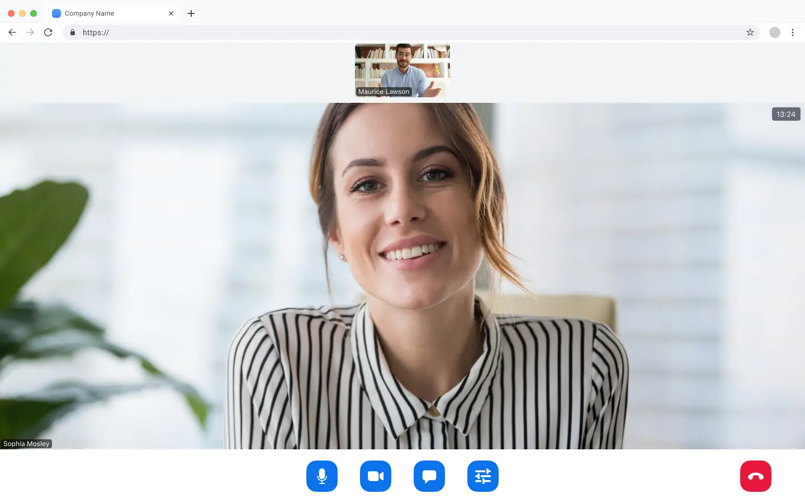

# Zoom Video SDK UI toolkit for web (beta)

Use of this SDK is subject to our [Terms of Use](https://explore.zoom.us/en/video-sdk-terms/).

The [Zoom Video SDK UI toolkit](https://developers.zoom.us/docs/video-sdk/web/ui-toolkit/) is a prebuilt video chat user interface powered by the Zoom Video SDK.



> Zoom Video SDK UI toolkit is in a public beta. [Share your feedback with us](https://zoom.sjc1.qualtrics.com/jfe/form/SV_3NMYztWpWzNVSiG), and leverage the [beta FAQ](https://developers.zoom.us/docs/video-sdk/web/ui-toolkit/#beta-faq) for details.

## Installation

In your frontend project, install the Video SDK UI toolkit:

```
$ npm install @zoom/videosdk-ui-toolkit --save
```

Or, for Vanilla JS applications, download the package and add it to your project. Then, add the following script and CSS style to the HTML page you want the UI toolkit to live on:

```html
<link rel="stylesheet" href="@zoom/videosdk-ui-toolkit/dist/videosdk-ui-toolkit.css">
<script src="@zoom/videosdk-ui-toolkit/index.js" type="module"></script>
```

## Setup

For webpack / single page applications like Angular, Vue, React, etc, import the UI toolkit, package and styles:

```js
import uitoolkit from '@zoom/videosdk-ui-toolkit'
import '@zoom/videosdk-ui-toolkit/dist/videosdk-ui-toolkit.css'
```

In Angular, CSS can't be imported directly into the component, instead, add the styles to your `angular.json` file in the styles array:

```JSON
"styles": [
  "node_modules/@zoom/videosdk-ui-toolkit/dist/videosdk-ui-toolkit.css",
]
```

Or, for Vanilla JS applications, import the JS file directly:

```js
import uitoolkit from './@zoom/videosdk-ui-toolkit/index.js'
```

> [JS imports](https://developer.mozilla.org/en-US/docs/Web/JavaScript/Guide/Modules#applying_the_module_to_your_html) work if your script tag has the `type="module"` attribute.

> UI toolkit CDN is coming soon to make vanilla JS usage easier.

## Usage

### Open Preview

To open the preview kit, to preview your camera, microphone, and speaker, create an HTML container that it will be render in:

```html
<div id='previewContainer'></div>
```

Then, call the `uitoolkit.openPreview` function, passing in the container reference:

```js
var previewContainer = document.getElementById('previewContainer')

uitoolkit.openPreview(previewContainer)
```

### Close Preview

To close the preview kit, call the `uitoolkit.closePreview` function:

```js
uitoolkit.closePreview(previewContainer)
```

### Join Session

To join a Video SDK session, create an HTML container that it will be render in:

```html
<div id='sessionContainer'></div>
```

Create your Video SDK session config object, with your [Video SDK JWT](https://developers.zoom.us/docs/video-sdk/auth/), and [Video SDK session info](https://developers.zoom.us/docs/video-sdk/web/sessions/#prerequisites), and the features you want to render.

```js
var config = {
  videoSDKJWT: '',
  sessionName: 'SessionA',
  userName: 'UserA',
  sessionPasscode: 'abc123',
  features: ['video', 'audio', 'share', 'chat', 'users', 'settings']
}
```

Currently, we support the following features:

| Feature    | Description                                         |
| ---------- | --------------------------------------------------- |
| `video`    | Enable the video layout, and to send and receive video.   |
| `audio`    | Show the audio button on the toolbar, and to send and receive audio.            |
| `share`    | Show the screen share button on the toolbar, and to send and receive screen share content.        |
| `chat`     | Show the chat button on the toolbar, and to send and receive session chats.        |
| `users`    | Show the users button on the toolbar, and to see the list of users in the session.        |
| `settings` | Show the settings button on the toolbar, and to configure virtual background, camera, microphone, and speaker devices, and see session quality statistics.       |


Then, call the `uitoolkit.joinSession` function, passing in the container reference, and the Video SDK session config object:

```js
var sessionContainer = document.getElementById('sessionContainer')

uitoolkit.joinSession(sessionContainer, config)
```

### Leave Session

To leave a Video SDK session, the user can click the red leave button. The host can also end the session for everyone, by clicking their red end button.

You can also leave a session programmatically by calling the `uitoolkit.closeSession` function:

```js
uitoolkit.closeSession(sessionContainer)
```

### Event Listeners

To subscribe to event listeners, define a callback function that you want to execute when the respective event is triggered:

```js
var sessionJoined = (() => {
  console.log('session joined')
})

var sessionClosed = (() => {
  console.log('session closed')
})
```

Then, pass the callback function to the respective **on** event listener (after calling the `uitoolkit.joinSession` function).

```js
uitoolkit.onSessionJoined(sessionJoined)

uitoolkit.onSessionClosed(sessionClosed)
```

To unsubscribe to event listeners, pass the callback function to the respective **off** event listener.

```js
uitoolkit.offSessionJoined(sessionJoined)

uitoolkit.offSessionClosed(sessionClosed)
```

Currently, we support the following event listeners:

| Event Listener     | Description                                         |
| ------------------ | --------------------------------------------------- |
| `onSessionJoined`  | Fires when the user joins the session successfully. |
| `onSessionClosed`  | Fires when the session is left or ended.            |
| `offSessionJoined` | Unsubscribes to the `onSessionJoined` event.        |
| `offSessionClosed` | Unsubscribes to the `onSessionClosed` event.        |

## Sample Apps

Sample apps built with the Video SDK UI toolkit are coming soon.

## Need help?

If you're looking for help, try [Developer Support](https://devsupport.zoom.us) or our [Developer Forum](https://devforum.zoom.us). Priority support is also available with [Premier Developer Support](https://zoom.us/docs/en-us/developer-support-plans.html) plans.